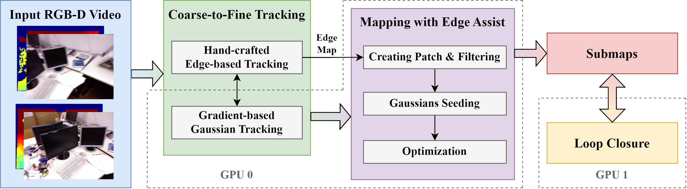

<p align="center">
  <h2 align="center">EAGS-SLAM: Edge-Assisted Gaussian Splatting SLAM</h2>
</p>

<div align="center">
  <h3>
    <a href="https://endermands.github.io/EAGSSLAM/">Project Page</a> | 
    <a href="">Paper (Under submission)</a>
  </h3>
</div>

<p align="center">
  
</p>

## Key Features
- **Coarse-to-Fine Tracking**: Combining edge-based visual odometry and gaussian tracking to reduce tracking time
- **Edge-Assisted Gaussian Seeding**: Using edge information for gaussian seeding to improve rendering quality
- **Parallel Loop Closure**: Optimized the submap system to run loop closure in parallel, improving system speed

# Setup

The code has been tested on: Ubuntu 20.04 LTS, Python 3.10.15, CUDA 12.1, RTX 4090

Install OpenCV 3.4 with contrib follow the instruction in [OpenCV](https://opencv.org/). Then modify `VO/CMakeLists.txt`.

Clone code:
``` shell
git clone --depth 1 --recursive https://github.com/EnderMandS/EAGS-SLAM.git
cd EAGS-SLAM
```

Make sure that gcc and g++ paths on your system are exported (fine them using `which gcc`):
``` shell
export CC=<gcc path>
export CXX=<g++ path>
```

Setup conda environment:
``` shell
conda create -n eags -c nvidia/label/cuda-12.1.0 cuda=12.1 cuda-toolkit=12.1 cuda-nvcc=12.1
conda env update --file environment.yml --prune
conda activate eags
pip install -r requirements.txt
cd thirdparty/Hierarchical-Localization
python -m pip install -e .
cd ../..
```

Build VO:
``` shell
cd VO
mkdir -p build && cd build
cmake ..
make -j
cd ../..
```

## Datasets
For Replica and TUM RGB-D:
``` shell
  git lfs install
  cd path/to/datasets
  git clone https://huggingface.co/datasets/voviktyl/Replica-SLAM
  git clone https://huggingface.co/datasets/voviktyl/TUM_RGBD-SLAM
```

For downloading ScanNet, follow the procedure described on <a href="http://www.scan-net.org/">here</a>. <b>Pay attention! </b> There are some frames in ScanNet with `inf` poses, we filter them out using `scripts/scannet_preprocess.py`. Please change the path to your ScanNet data and run the cells.

## Usage
For a single scene:
``` shell
python run_slam.py configs/<dataset_name>/<config_name> --input_path <path_to_the_scene> --output_path <output_path>
# example
python run_slam.py configs/TUM_RGBD/rgbd_dataset_freiburg1_desk.yaml | tee log/tum/desk_0.log
```

You can also configure input and output paths in the config yaml file.

For all scenes:
``` shell
./reproducing.sh
``` 

For headless running, please config the plot_backend before running:
``` shell
evo_config set plot_backend agg
```

If you are running it for the first time, it may take some time to download the model.

# Citation
```bib
Under submission
```
